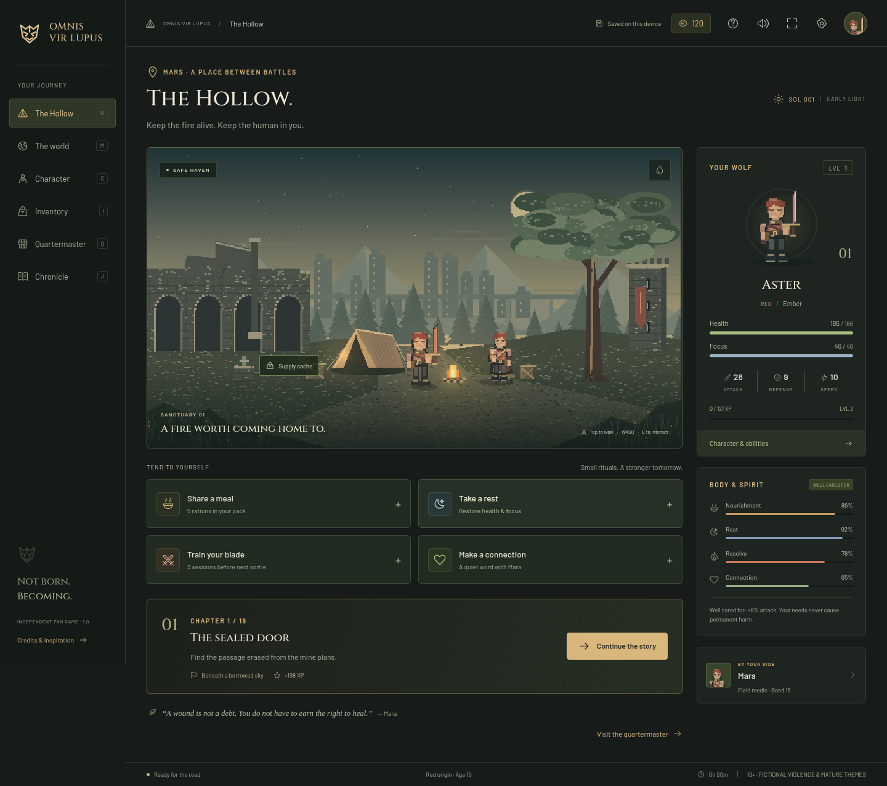

# Omnis Vir Lupus

**Tend to a life. Temper a blade. Choose what survives the revolution.**

A free, independent, browser-playable **Red Rising fan RPG**. Part character
care, part turn-based adventure, set around a refuge called the Hollow.
Built with Phaser, TypeScript, original pixel artwork, and synthesized music.

[Play in your browser](https://carlos-aws.github.io/omnis-vir-lupus/)
· [Player guide](docs/player-guide.md)
· [Pixel Pals review](docs/pixel-pals-review.md)
· [Development guide](AGENTS.md)
· [Verification and limits](docs/verification.md)



## A life beyond the weapon

- **Three origins:** Red, Gold, or Obsidian. Each begins with different
  memories, a companion, equipment, and an origin ability. The first three
  chapters branch; the paths converge in the Hollow in Chapter 4.
- **The Carving:** the Red path becomes a Gold at the end of Chapter 3.
  Appearance changes while Red identity, memories, and Mineborn fury remain.
- **Eight life phases:** begin at sixteen and grow from Ember to Living
  legend. Each phase has distinct visual details. The level cap is **80**.
- **Care:** nourishment, rest, resolve, and connection affect readiness.
  Eat, sleep, train, talk, gather supplies, and wash at camp. No lessons,
  calendar gates, permanent death, or punishment for taking time away.
- **A complete campaign:** 16 chapters, 64 operations, 256 encounters,
  16 chapter bosses, moral choices, three endings, and repeatable patrols.
- **Tactical battles:** five elements, visible enemy intentions, weaknesses,
  shield breaks, Burst, status effects, active companion support, supplies,
  and three difficulty settings.
- **A growing arsenal:** 19 ability definitions, 46 equipment pieces,
  consumables, forge materials, a shop, five upgrade levels, and visible
  weapons, armor, and relics. Origin abilities are mutually exclusive.
- **A remembered journey:** four companions with bonds, a bestiary,
  a field journal, and milestones.
- **A skippable pixel prologue**, original ambient score, elemental effects,
  responsive touch and keyboard controls, reduced motion, and larger text.

The intended audience is **16+** for stylized violence, oppression, loss,
and non-graphic body modification. This is guidance, **not an official
ESRB or PEGI rating**.

## Play and keep your progress

Use a modern browser on a phone, tablet, laptop, or desktop. Choose an origin,
name your character, and follow **Continue the story** from camp.
Settings contains the field guide, difficulty, audio, and save controls.

Every committed action saves on this device, including combat turns.
**Export save** downloads a portable JSON backup; **Import save** validates
it before replacement. A previous valid checkpoint is also retained.
Progress is per browser profile and site address; there is no cloud account.
Keep an export before clearing browser data or moving devices.

After the complete game is cached, it works offline. The game announces when
this is ready. Updates offer **Save & update** before reloading. Installation
through the browser’s “Add to Home Screen” option is optional.

## Run locally

Use **Node.js 22.18 or newer** and npm. Node 22 is used in CI.

```sh
npm ci
npm run dev
```

Open the local address printed by Vite. To serve the production build:

```sh
npm run build
npm run preview
```

The game is a static site. Publish **`dist/`** over HTTPS; relative asset
paths support repository subpaths. The included workflow tests the game
before publishing `main` to GitHub Pages. No backend, API key, paid engine,
asset subscription, analytics service, or external font CDN is required.

## Inspiration and license

All credit for **Red Rising**, its world, Colors, story inspiration, and
original series characters belongs to **Pierce Brown** and the respective
rights holders. This is an unofficial, noncommercial fan game, unaffiliated
with and not endorsed by Pierce Brown, his publishers, or other rights holders.

The protagonist, companions, campaign dialogue, art, and music are original
to this project. No book passages, official artwork, or commercial game
assets are included. Original project code and assets are MIT licensed;
this does not grant rights to the underlying Red Rising intellectual property.
See [LICENSE](LICENSE) and [third-party notices](THIRD_PARTY_NOTICES.md).

The 10–14 hour Standard campaign is a **pacing target**, not a measured
minimum. AAA quality is an aspiration, not a certification or a claim about
this independent release. See the verification document for actual evidence.
